<!-- GitHub profile README: automatically follows the visitor's theme -->
<picture>
  <source media="(prefers-color-scheme: dark)" srcset="dark.svg">
  <source media="(prefers-color-scheme: light)" srcset="light.svg">
  
</picture>

## Projects

| Project | What it is | Built with |
| --- | --- | --- |
| [**ATLAS**](https://github.com/albangerschheimer/ATLAS) | Local-first strength & health tracker for iPhone — no account, no server, your data stays on the device | Swift · SwiftUI · SwiftData · HealthKit |
| [**Claude Float**](https://github.com/albangerschheimer/claude-float) | Claude in a floating macOS window, one keystroke away — with ChatGPT and Gemini in the same panel | Swift · SwiftUI · WebKit |
| [**Ligue 1 Match Predictor**](https://github.com/albangerschheimer/Predictions-Foot) | Predicting football results from Elo and recent form — [live demo](https://pronostic-foot.vercel.app) | Python · scikit-learn · FastAPI |
| [**Fake News Detection**](https://github.com/albangerschheimer/fake-news-detection-r) | TF-IDF over 44,898 articles, Naive Bayes vs Logistic Regression | R · tm · caret · glmnet |
| [**Lower Back Pain Prediction**](https://github.com/albangerschheimer/Lower-Back-Pain-Prediction) | Classifying patients from biomechanical spine measurements | Python · scikit-learn · pandas |
| [**Maritime Pressures in Europe**](https://github.com/albangerschheimer/Projet-Pression-maritimes-Europe) | 459,773 GBIF occurrences vs. distance to ports and offshore infrastructure | SQL · R Markdown |
| [**DeepLearning MIASHS**](https://github.com/albangerschheimer/Project-Deeplearning-S3-Miashs) | Text clustering and image classification, seven models compared | Orange Data Mining |

## About

MIASHS student (data science and social sciences), focused on health data and
machine learning. I like projects that go all the way: real data, honest
evaluation, and something you can actually open and use at the end.

**Toolkit** — Python · pandas · NumPy · scikit-learn · Jupyter · R · SQL ·
Swift · React · JavaScript · Git

## Elsewhere

**[albangerschheimer.vercel.app](https://albangerschheimer.vercel.app/#portfolio)** — portfolio
